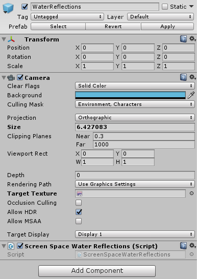
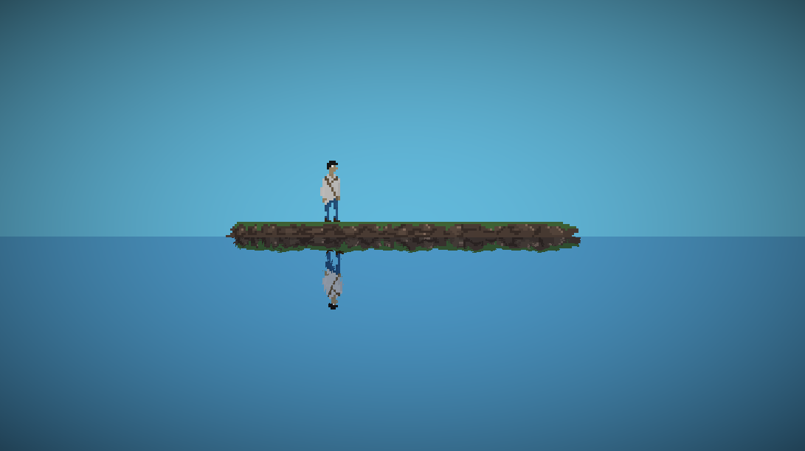

# Unity 2D Water

# Usage:
It requires setup consisting of 2 cameras.

1. Create a second camera and parent it to the main camera.

**IMPORTANT**: Second camera must have same settings for orthographic projection as the main camera.

2. Attach script called ScreenSpaceWaterReflections to second camera.

3. Set culling on second camera to layers that will be reflected on the water.

4. Now you can put a Water prefab on scene.
5. Done

Screenshot have Vignetting post process on it.

# License:
Fell free to use in personal and commercial projects.

